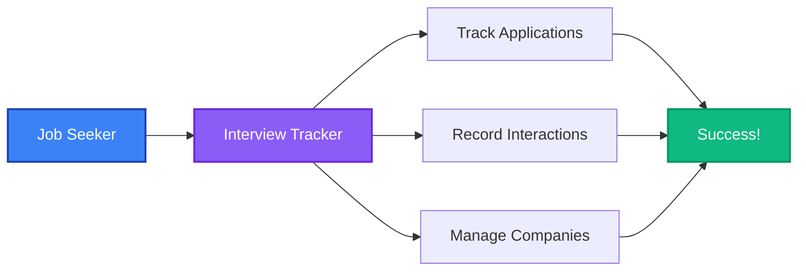

## Welcome to Interview Tracker

A comprehensive web application for managing job interviews and tracking your entire job application journey.

### Quick Links

- [Concept V1](/docs/v1/concept) - Product concept and feature specifications
- [Architecture](/docs/v1/architecture) - System architecture and design decisions

### What is Interview Tracker?

Interview Tracker is a modern web application that helps job seekers:

- **Track Multiple Interviews** - Manage all your job applications in one place
- **Record Interactions** - Keep a chronological history of all communications
- **Store Company Information** - Organize salary, benefits, and contact details
- **Monitor Progress** - Track interview stages and outcomes

### Technology Stack

Built with modern, type-safe technologies:

- **Frontend:** React with TanStack Start (SSR)
- **Backend:** Elysia (TypeScript)
- **Database:** PostgreSQL with Drizzle ORM
- **Authentication:** Better-Auth
- **API:** ORPC (type-safe RPC)

### Getting Started

Check out the [Concept V1](/docs/v1/concept) document to understand the product vision and features, or dive into the [Architecture](/docs/v1/architecture) to see how everything fits together.

### Example: System Flow

