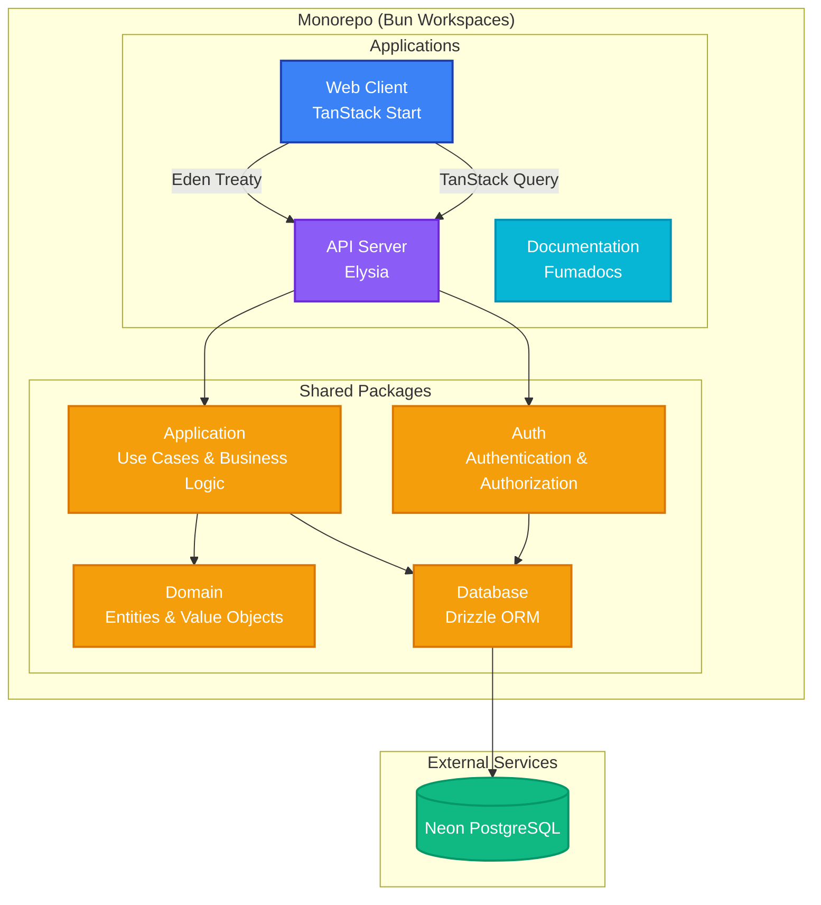
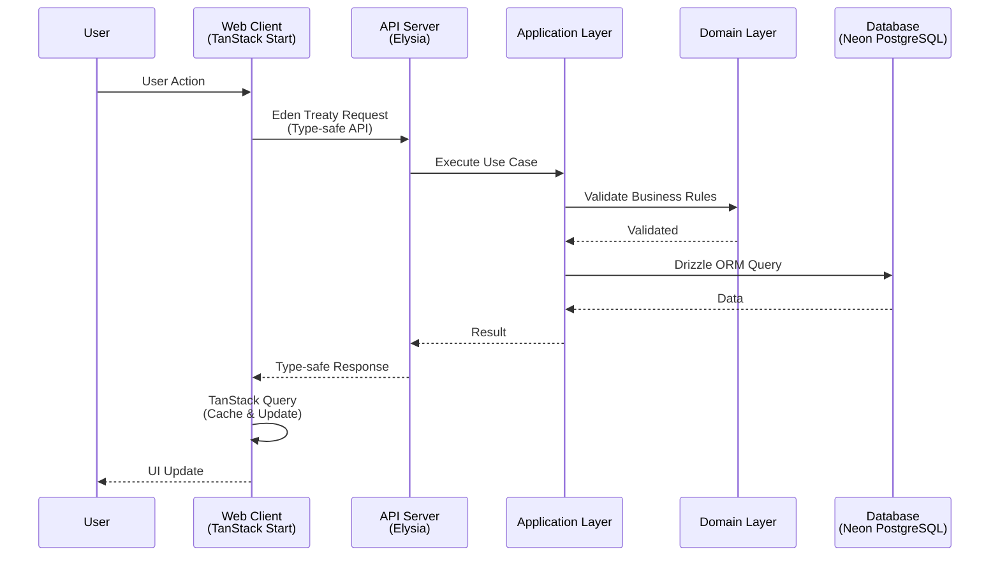

## System Architecture

This document outlines the architecture of the Interview Tracker application.

### Overview

It's going to be a client-server application. We're going to use a monorepo approach to manage the project using Bun workspaces.

### System Diagram

### Applications

We're going to have the following applications:

- **client (web)**: we're going to use the following packages:
  - tanstack start
  - tanstack query
  - tanstack Form
  - tanstack table
  - zod
  - zustand
  - shadcn/ui
  - tailwindcss
  - typescript
  - react
  - react-dom
  - react-router
  - react-router-dom
  - react-router-dom-v5
  - alchemy
  - cloudflare
- **server**: we're going to use the following packages:
  - elysia
  - eden treaty
  - tanstack query
  - zod
  - drizzle orm
  - neon postgres
  - better auth
- **docs**: we're going to use the following packages:
  - fumadocs
  - typescript
  - react
  - react-dom
  - react-router
  - react-router-dom
  - react-router-dom-v5

### Shared Packages

We're going to have the following packages:

- **domain**: For the domain entities and value objects
- **application**: For the use cases and the business logic
- **database**: For the database interactions
- **auth**: For the authentication and authorization implementation

### Database

For the database we're going to use:

- **Neon Postgres** as the database provider
- **Drizzle ORM** for type-safe database interactions

### Communication Flow

### Backend ↔ Frontend Communication

How we're going to communicate the backend and the frontend:

- **Elysia + Eden Treaty** for API type safety
- **TanStack Query** to manage data fetching and caching
- **Domain package** to share entities and value objects between backend and frontend

### Key Design Decisions

1. **Type Safety:** End-to-end type safety with TypeScript, Elysia, and Eden Treaty
2. **Monorepo Structure:** Organized with Bun workspaces for better code sharing
3. **Domain-Driven Design:** Separation of concerns with domain, application, and infrastructure layers
4. **Modern Stack:** Leveraging cutting-edge tools for performance and developer experience
