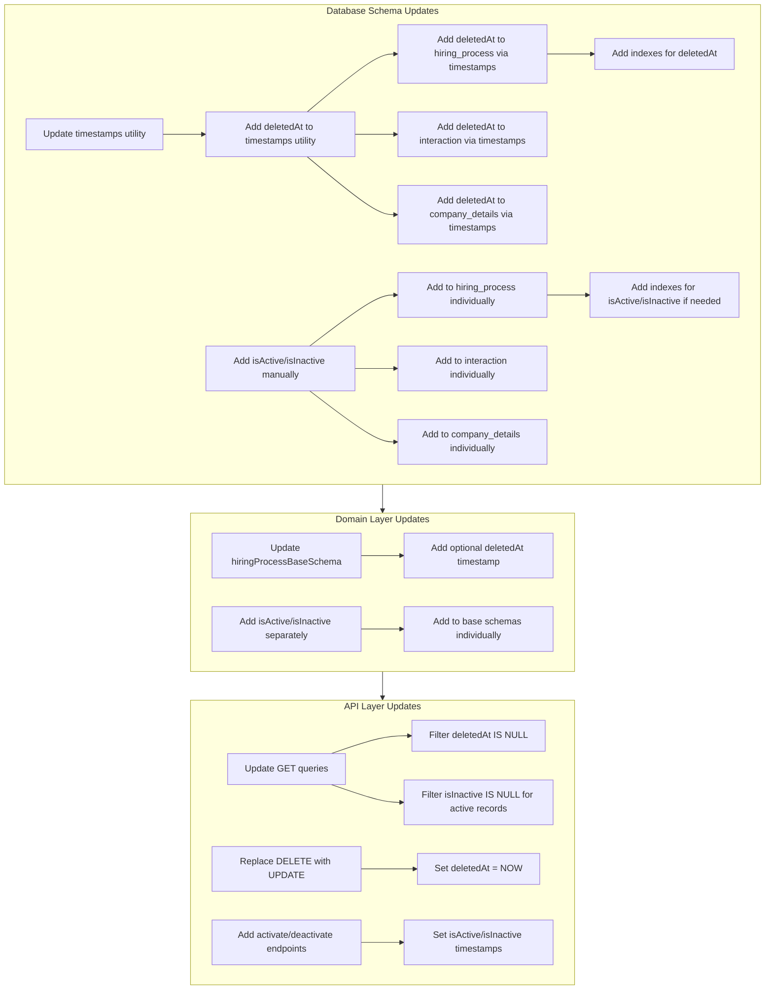

# Soft Delete Implementation Plan

## Document Information

| Field            | Value                        |
| ---------------- | ---------------------------- |
| **Version**      | v1                           |
| **Date**         | January 27, 2025             |
| **Status**       | Draft (Planning)             |
| **Feature Type** | Database & API Enhancement   |
| **Scope**        | Database, Domain, API Layers |

---

## Overview

This document outlines the implementation plan for adding soft delete functionality and active/inactive status tracking to key tables in the hiring tool system. This implementation introduces timestamp-based fields for tracking record lifecycle states, enabling data recovery, audit trails, and flexible status management.

### Scope

The implementation will be applied to the following tables:

- `hiring_process` - Hiring process records
- `interaction` - Interaction records
- `company_details` - Company detail records

### Timestamp Fields

#### Standard Timestamps (via `timestamps` utility)

These fields are provided by the reusable `timestamps` utility:

- **`createdAt`**: Timestamp when the record was created
- **`updatedAt`**: Timestamp when the record was last updated
- **`deletedAt`**: Timestamp when the record was soft deleted (nullable)

#### Active/Inactive Status Fields (Separate Implementation)

**Important:** `isActive` and `isInactive` are NOT part of the `timestamps` utility. They are separate status fields that should be added individually to tables as needed.

- **`isActive`**: Timestamp when the record became active
  - `null`/`undefined` = not active
  - Has timestamp = active (timestamp indicates when it became active)
- **`isInactive`**: Timestamp when the record became inactive
  - `null`/`undefined` = not inactive
  - Has timestamp = inactive (timestamp indicates when it became inactive)

**Implementation Note:** These fields must be added manually to each table schema, not via the `timestamps` utility spread.

### Key Distinctions

**Soft Delete (`deletedAt`) vs Inactive Status (`isInactive`):**

- **`deletedAt`**: Used for soft deletion - marks a record as deleted for recovery purposes
- **`isInactive`**: Used for status management - marks a record as inactive without deleting it
- **Independent States**: A record can be:
  - Active and not deleted (`isActive` has timestamp, `isInactive` is null, `deletedAt` is null)
  - Inactive but not deleted (`isInactive` has timestamp, `deletedAt` is null)
  - Deleted but was active (`deletedAt` has timestamp, `isActive` may have timestamp)
  - Deleted and inactive (`deletedAt` has timestamp, `isInactive` has timestamp)
  - Any combination of these states

**Status Logic:**

- To check if **active**: `isActive` has a timestamp AND `isInactive` is null
- To check if **inactive**: `isInactive` has a timestamp
- To check if **deleted**: `deletedAt` has a timestamp

### Benefits

- **Data Recovery**: Ability to restore accidentally deleted records
- **Audit Trail**: Maintain historical data with precise timestamps for compliance and analytics
- **Status Management**: Flexible active/inactive states independent of deletion
- **Referential Integrity**: Preserve relationships even after "deletion" or inactivation
- **Performance**: Faster than hard deletes (no cascade operations)
- **Timestamp History**: Know exactly when records became active, inactive, or deleted

---

## Implementation Flow



---

## Implementation Phases

### Phase 1: Database Schema Updates

#### 1.1 Update Timestamps Utility

Update the reusable `timestamps` utility to include soft delete:

**File:** `packages/db/src/utils/timestamps.ts`

The utility should contain:

- `createdAt`: Timestamp when record was created
- `updatedAt`: Timestamp when record was last updated
- `deletedAt`: Timestamp when record was soft deleted (nullable)

**Important:** `isActive` and `isInactive` are NOT part of this utility. They are separate status fields.

#### 1.2 Update Tables with Soft Delete

Add `deletedAt` to each table via the `timestamps` utility spread:

**hiring_process:**

- `deletedAt` (timestamp, nullable) - Added via `...timestamps` spread

**interaction:**

- `deletedAt` (timestamp, nullable) - Added via `...timestamps` spread

**company_details:**

- `deletedAt` (timestamp, nullable) - Added via `...timestamps` spread

#### 1.3 Add Active/Inactive Status Fields (Separate Implementation)

**Important:** These fields must be added manually to each table, NOT via the `timestamps` utility.

Add `isActive` and `isInactive` fields individually to each table:

**hiring_process:**

```typescript
isActive: timestamp("is_active"),
isInactive: timestamp("is_inactive"),
```

**interaction:**

```typescript
isActive: timestamp("is_active"),
isInactive: timestamp("is_inactive"),
```

**company_details:**

```typescript
isActive: timestamp("is_active"),
isInactive: timestamp("is_inactive"),
```

**Field Behavior:**

- All timestamp fields are nullable
- `isActive` and `isInactive` are independent - a record can have both, neither, or one
- `deletedAt` is independent of active/inactive status
- When activating: set `isActive = NOW()`, clear `isInactive = NULL`
- When deactivating: set `isInactive = NOW()`, optionally clear `isActive = NULL` or leave it

#### 1.4 Add Indexes

Create indexes for performance optimization:

- Index on `deletedAt` for efficient filtering of deleted records (already implemented)
- Index on `isInactive` for efficient filtering of active records (add when implementing isActive/isInactive)
- Composite indexes if needed for common query patterns (e.g., `(deletedAt, isInactive)`) (add when implementing isActive/isInactive)

**Rationale:**

- Indexes on `deletedAt` will significantly improve query performance when filtering out deleted records
- Indexes on `isInactive` will improve performance when filtering for active records (where `isInactive IS NULL`)
- Composite indexes can optimize queries that filter by both deletion and active status

---

### Phase 2: Domain Layer Updates

#### 2.1 Update Base Schemas with Soft Delete

Update domain schemas to include optional `deletedAt` timestamp field:

- `hiringProcessBaseSchema` - Add optional `deletedAt` timestamp field
- Update other related schemas similarly (`interactionBaseSchema`, `companyDetailsBaseSchema`)

#### 2.2 Add Active/Inactive Status Fields (Separate Implementation)

**Important:** Add `isActive` and `isInactive` fields separately to domain schemas when implementing status management.

- `hiringProcessBaseSchema` - Add optional `isActive` and `isInactive` timestamp fields (when implementing)
- Update other related schemas similarly (when implementing)

#### 2.3 Type Safety

Ensure TypeScript types reflect the new optional timestamp fields:

- Export updated types from schema with nullable timestamps
- Update domain types to include:
  - `deletedAt?: Date | null` (for soft delete)
  - `isActive?: Date | null` (when implementing status management)
  - `isInactive?: Date | null` (when implementing status management)
- Maintain backward compatibility with existing code
- Create helper functions to check status:
  - `isDeleted(record)` - checks if `deletedAt` is not null
  - `isActive(record)` - checks if `isActive` has timestamp AND `isInactive` is null (when implementing)
  - `isInactive(record)` - checks if `isInactive` has timestamp (when implementing)

---

### Phase 3: API Layer Updates

#### 3.1 Update GET Queries

Modify all GET endpoints to filter out soft-deleted records and optionally filter by active status:

**Basic Pattern (exclude deleted):**

```typescript
.where(and(
  // existing conditions
  isNull(table.deletedAt)
))
```

**Pattern with Active Status Filter:**

```typescript
.where(and(
  // existing conditions
  isNull(table.deletedAt),
  isNull(table.isInactive) // Only show active records
))
```

**Query Options:**

- Default behavior: Exclude deleted records (`deletedAt IS NULL`)
- Optional query parameter: `?active=true` to filter for active records only
- Optional query parameter: `?includeInactive=true` to include inactive records

**Affected Endpoints:**

- `GET /api/hiring-processes` - List hiring processes (exclude deleted, optionally filter active)
- `GET /api/hiring-processes/:id` - Get single hiring process (must not be deleted)
- `GET /api/interactions` - List interactions (exclude deleted, optionally filter active)
- `GET /api/interactions/:id` - Get single interaction (must not be deleted)
- `GET /api/companies` - List companies (exclude deleted, optionally filter active)
- `GET /api/companies/:id` - Get single company (must not be deleted)

#### 3.2 Replace DELETE Endpoints

Convert hard DELETE operations to soft deletes:

**Before:**

```typescript
DELETE /api/hiring-processes/:id
// Hard delete from database
```

**After:**

```typescript
DELETE /api/hiring-processes/:id
// Soft delete: UPDATE SET deletedAt = NOW()
```

**Implementation:**

- Replace `db.delete()` with `db.update()`
- Set `deletedAt = new Date()` or use database `NOW()`
- Do NOT modify `isActive` or `isInactive` - deletion is independent
- Return 204 No Content (same as before)
- Maintain same endpoint signature for backward compatibility

#### 3.3 Add Active/Inactive Status Endpoints

Add endpoints to manage active/inactive status without deleting:

**Activate Record:**

- `PATCH /api/hiring-processes/:id/activate` - Set `isActive = NOW()`, clear `isInactive = NULL`
- `PATCH /api/interactions/:id/activate` - Same for interactions
- `PATCH /api/companies/:id/activate` - Same for companies

**Deactivate Record:**

- `PATCH /api/hiring-processes/:id/deactivate` - Set `isInactive = NOW()`
- `PATCH /api/interactions/:id/deactivate` - Same for interactions
- `PATCH /api/companies/:id/deactivate` - Same for companies

**Implementation Details:**

- Activation: Set `isActive = new Date()`, set `isInactive = null`
- Deactivation: Set `isInactive = new Date()` (keep `isActive` timestamp for history)
- These operations are independent of `deletedAt`
- A record can be activated/deactivated even if it's deleted (though typically filtered out)

---

## Technical Considerations

### Query Performance

- **Indexes**: Critical for maintaining query performance with soft delete and active status filtering
- **Query Patterns**:
  - All list queries will need `WHERE deletedAt IS NULL`
  - Active-only queries will need `WHERE deletedAt IS NULL AND isInactive IS NULL`
- **Count Queries**: May need adjustment to exclude deleted records and optionally inactive records
- **Composite Indexes**: Consider composite indexes for common filter combinations

### Data Migration

- **Existing Data**:
  - All existing records will have `deletedAt = NULL` (not deleted)
  - All existing records will have `isActive = NULL` and `isInactive = NULL` (status undefined)
- **Migration Strategy**:
  - Option 1: Leave existing records with null timestamps (status undefined)
  - Option 2: Backfill existing records: set `isActive = createdAt` to mark them as active
- **No Breaking Changes**: New columns are nullable, existing data remains valid
- **Backfill Decision**: Determine if existing records should be marked as active by default

### API Compatibility

- **Backward Compatible**: GET endpoints will automatically exclude deleted records
- **Active Status**: Optional filtering - existing queries work, new `?active=true` parameter available
- **DELETE Behavior Change**: DELETE now soft deletes instead of hard delete
- **New Endpoints**: Activate/deactivate endpoints are additive (no breaking changes)
- **No Breaking Changes**: Existing API contracts maintained

### Recovery Operations

- **Future Consideration**: May need admin endpoints to restore deleted records
- **Status Management**: Can activate/deactivate records independently of deletion
- **Permanent Delete**: May need a separate endpoint for true hard deletes (admin only)
- **Audit Logging**: Consider logging who deleted/activated/deactivated records and when
- **State Combinations**: Handle edge cases where records are both deleted and inactive

---

## Database Schema Changes

### New Columns

#### Soft Delete Fields (via `timestamps` utility)

Each affected table will have `deletedAt` added via the `timestamps` utility:

```typescript
// Via timestamps utility spread
...timestamps, // includes createdAt, updatedAt, deletedAt

// Where timestamps utility contains:
createdAt: timestamp('created_at').defaultNow().notNull(),
updatedAt: timestamp('updated_at').defaultNow().notNull(),
deletedAt: timestamp('deleted_at').default(null),
```

**Field Definitions:**

- `createdAt`: Set automatically when record is created
- `updatedAt`: Updated automatically on record modification
- `deletedAt`: Set to current timestamp when record is soft deleted, `null` otherwise

#### Active/Inactive Status Fields (Separate Implementation)

**Important:** These fields must be added manually to each table, NOT via the `timestamps` utility.

When implementing status management, add these fields individually:

```typescript
// Add manually to each table schema
isActive: timestamp('is_active').default(null),
isInactive: timestamp('is_inactive').default(null),
```

**Field Definitions:**

- `isActive`: Timestamp when record became active, `null` if never activated
- `isInactive`: Timestamp when record became inactive, `null` if not inactive

### Indexes

#### Soft Delete Indexes (Implemented)

```sql
-- Soft delete indexes (already added)
CREATE INDEX idx_hiring_process_deleted_at ON hiring_process(deleted_at);
CREATE INDEX idx_interaction_deleted_at ON interaction(deleted_at);
CREATE INDEX idx_company_details_deleted_at ON company_details(deleted_at);
```

#### Active/Inactive Status Indexes (Add When Implementing)

**Important:** Add these indexes when implementing `isActive` and `isInactive` fields.

```sql
-- Active status indexes (add when implementing isActive/isInactive)
CREATE INDEX idx_hiring_process_is_inactive ON hiring_process(is_inactive);
CREATE INDEX idx_interaction_is_inactive ON interaction(is_inactive);
CREATE INDEX idx_company_details_is_inactive ON company_details(is_inactive);

-- Composite indexes for common query patterns (optional, add when implementing)
CREATE INDEX idx_hiring_process_status ON hiring_process(deleted_at, is_inactive);
CREATE INDEX idx_interaction_status ON interaction(deleted_at, is_inactive);
CREATE INDEX idx_company_details_status ON company_details(deleted_at, is_inactive);
```

---

## Testing Considerations

### Unit Tests

- Test that GET queries exclude deleted records (`deletedAt IS NULL`)
- Test that GET queries with `?active=true` filter inactive records (`isInactive IS NULL`)
- Test that DELETE sets `deletedAt` instead of removing record
- Test that soft-deleted records are not returned in lists
- Test that soft-deleted records cannot be accessed by ID
- Test activate endpoint sets `isActive` timestamp and clears `isInactive`
- Test deactivate endpoint sets `isInactive` timestamp
- Test that active/inactive status is independent of deletion
- Test status helper functions (`isDeleted`, `isActive`, `isInactive`)

### Integration Tests

- Test full CRUD flow with soft delete
- Test activate/deactivate flow
- Test that relationships are preserved after soft delete
- Test that relationships are preserved after deactivation
- Test query performance with indexes
- Test concurrent operations on soft-deleted records
- Test state combinations (deleted+active, deleted+inactive, active+inactive, etc.)
- Test filtering combinations (active only, include inactive, exclude deleted)

### Manual Testing

- Verify deleted records don't appear in UI
- Verify inactive records are filtered when `?active=true` is used
- Verify DELETE operations work as expected (soft delete)
- Verify activate/deactivate endpoints work correctly
- Verify data is preserved in database (not physically deleted)
- Verify timestamps are set correctly for all operations
- Verify indexes improve query performance
- Verify state independence (can delete active record, can activate deleted record, etc.)

---

## Rollout Strategy

### Phase 1: Database Migration

1. Add columns to database schema
2. Generate and run migration
3. Add indexes
4. Verify schema changes

### Phase 2: Domain Updates

1. Update domain schemas
2. Update TypeScript types
3. Verify type safety

### Phase 3: API Updates

1. Update GET queries to filter deleted records
2. Add optional active status filtering to GET queries
3. Replace DELETE endpoints with soft delete
4. Add activate/deactivate endpoints
5. Test all affected endpoints
6. Verify backward compatibility

### Phase 4: Frontend (if needed)

1. Update UI to reflect soft delete behavior
2. Add restore functionality (if needed)
3. Update delete confirmations (optional)

---

## Future Enhancements

### Potential Additions

- **Restore Endpoint**: `POST /api/hiring-processes/:id/restore` - Restore soft-deleted record (clear `deletedAt`)
- **Hard Delete Endpoint**: `DELETE /api/hiring-processes/:id/hard` - Permanent delete (admin only)
- **Deleted Records View**: Admin view to see all deleted records
- **Inactive Records View**: View to see all inactive records
- **Bulk Operations**:
  - Bulk soft delete/restore operations
  - Bulk activate/deactivate operations
- **Audit Trail**: Track who deleted/activated/deactivated records and when
- **Retention Policy**: Automatically hard delete after X days
- **Status History**: Track status changes over time (may require separate history table)

---

## Dependencies

### Required Changes

- Database schema migration
- Domain schema updates
- API endpoint modifications
- Query updates across all affected endpoints

### No Breaking Changes

- Existing API contracts maintained
- Frontend changes optional (will work with existing UI)
- No data loss during migration

---

## Success Criteria

- ✅ All three tables have `deletedAt`, `isActive`, and `isInactive` timestamp columns
- ✅ Indexes created for performance (on `deletedAt` and `isInactive`)
- ✅ All GET queries exclude soft-deleted records (`deletedAt IS NULL`)
- ✅ GET queries support optional active status filtering (`?active=true`)
- ✅ DELETE endpoints perform soft delete (set `deletedAt` timestamp)
- ✅ Activate/deactivate endpoints work correctly
- ✅ Active/inactive status is independent of deletion status
- ✅ No breaking changes to existing API
- ✅ Type safety maintained throughout
- ✅ Query performance maintained or improved
- ✅ Timestamps are set correctly for all operations

---

## Notes

### Implementation Notes

- This is a database and API layer change primarily
- Frontend changes are minimal (delete will work the same from user perspective)
- Active/inactive status can be managed independently of deletion
- Timestamps provide precise audit trail of when records changed state

### Status Logic Examples

**Active Record:**

- `isActive` = `2025-01-15 10:00:00`
- `isInactive` = `null`
- `deletedAt` = `null`
- Result: Record is active and not deleted

**Inactive Record:**

- `isActive` = `2025-01-15 10:00:00`
- `isInactive` = `2025-01-20 14:30:00`
- `deletedAt` = `null`
- Result: Record is inactive but not deleted

**Deleted Record (was active):**

- `isActive` = `2025-01-15 10:00:00`
- `isInactive` = `null`
- `deletedAt` = `2025-01-25 09:00:00`
- Result: Record is deleted (was active when deleted)

**Deleted and Inactive Record:**

- `isActive` = `2025-01-15 10:00:00`
- `isInactive` = `2025-01-20 14:30:00`
- `deletedAt` = `2025-01-25 09:00:00`
- Result: Record is both deleted and inactive

### Future Considerations

- Consider adding restore functionality in a future phase
- Monitor query performance after index creation
- Consider adding audit logging for delete/activate/deactivate operations
- Consider adding status history table if tracking state changes over time is needed
- Determine default behavior for existing records (should they be marked as active?)
