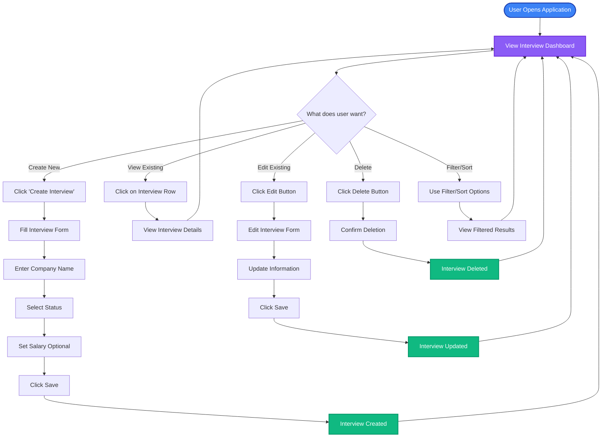
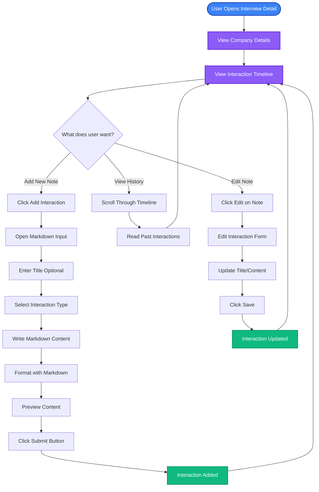
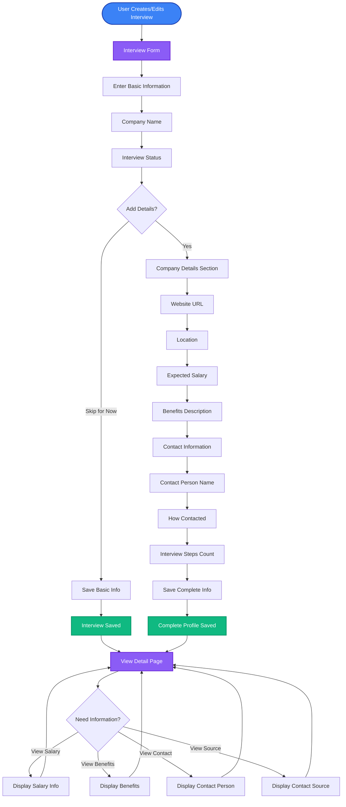
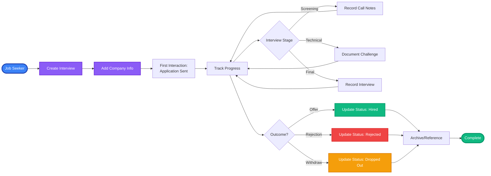

## Overview

This document outlines the key user stories and their corresponding interaction flows, showing how job seekers interact with the Interview Tracker application.

## Epic 1: Interview Management

**As a** job seeker,  
**I want to** create and manage multiple interview processes,  
**So that** I can keep track of all my job applications in one place.

### User Flow: Managing Interviews

### Key User Actions

1. **Create Interview** - Add new company to tracking list
2. **View Interviews** - Browse all applications in table format
3. **Edit Interview** - Update company information or status
4. **Delete Interview** - Remove completed or cancelled applications
5. **Filter/Sort** - Organize interviews by status, salary, or date

---

## Epic 2: Interaction Tracking

**As a** job seeker,  
**I want to** record all interactions with companies,  
**So that** I can maintain a chronological history of communications and activities.

### User Flow: Recording Interactions

### Interaction Types

- **Email** - Correspondence with recruiters or hiring managers
- **Phone Call** - Phone screening or follow-up calls
- **Meeting** - In-person or virtual interviews
- **Technical Challenge** - Coding tests or assignments
- **Offer** - Job offer received
- **Rejection** - Application declined
- **Follow-up** - Status check or thank you notes

### Key User Actions

1. **Add Interaction** - Record new communication or event
2. **Format with Markdown** - Rich text formatting for detailed notes
3. **Specify Type** - Categorize interaction for better organization
4. **View Timeline** - Browse chronological history
5. **Edit Notes** - Update or correct previous interactions

---

## Epic 3: Company Information Management

**As a** job seeker,  
**I want to** store detailed company information,  
**So that** I can quickly reference salary, benefits, and contact details.

### User Flow: Managing Company Information

### Company Information Fields

**Required:**

- Company Name
- Interview Status

**Optional but Recommended:**

- Website URL
- Location
- Expected Salary
- Benefits Description
- Contact Person
- Source (LinkedIn, Email, Referral, etc.)
- Number of Interview Steps

### Key User Actions

1. **Input Basic Info** - Add company name and status (minimum requirement)
2. **Add Detailed Info** - Include salary, benefits, and contact details
3. **Specify Contact Source** - Track where the opportunity came from
4. **Access Information** - Quick reference from detail view
5. **Update Details** - Modify information as interview progresses

---

## Complete User Journey

### End-to-End Flow: From Application to Outcome

---

## User Scenarios

### Scenario 1: New Job Application

1. User sees job posting on LinkedIn
2. Opens Interview Tracker
3. Clicks "Create Interview"
4. Enters company name and initial status
5. Adds note: "Applied via LinkedIn, position: Senior Developer"
6. Saves and continues job search

### Scenario 2: Interview Preparation

1. User receives interview invitation email
2. Opens interview detail in tracker
3. Adds new interaction: "Interview scheduled for Dec 25"
4. Reviews previous notes and company information
5. Adds preparation notes in markdown
6. Checks salary expectations before interview

### Scenario 3: Post-Interview Follow-up

1. User completes interview
2. Opens interview detail immediately after
3. Adds detailed notes while fresh in memory
4. Includes: questions asked, interviewer names, key points discussed
5. Sets reminder to follow up in 3 days
6. Updates status to "Awaiting Response"

### Scenario 4: Managing Multiple Applications

1. User has 10+ active applications
2. Opens dashboard to see all interviews
3. Filters by "Ongoing" status
4. Sorts by "Last Updated" to prioritize follow-ups
5. Quickly identifies applications needing attention
6. Updates statuses and adds notes as needed

---

## Success Metrics

- **Time Saved**: 50% reduction in time spent managing applications
- **Organization**: 100% of applications tracked in one place
- **History**: Complete chronological record of all interactions
- **Decision Making**: Quick access to salary and benefits for comparison
- **Follow-ups**: Never miss a follow-up opportunity
